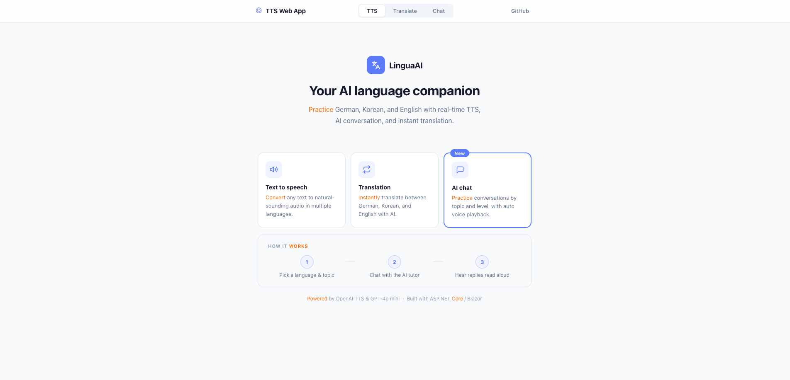
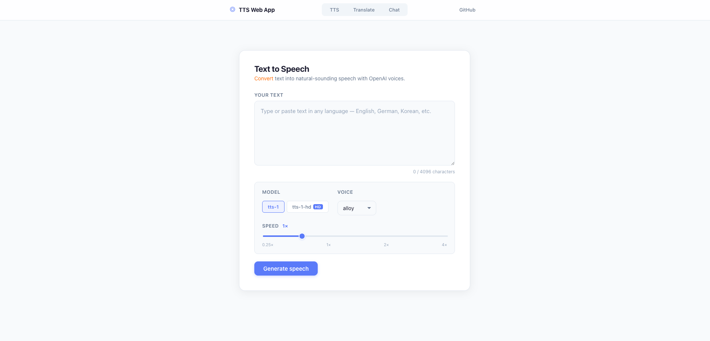
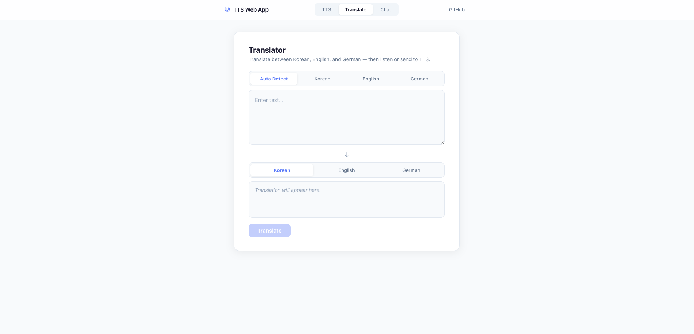
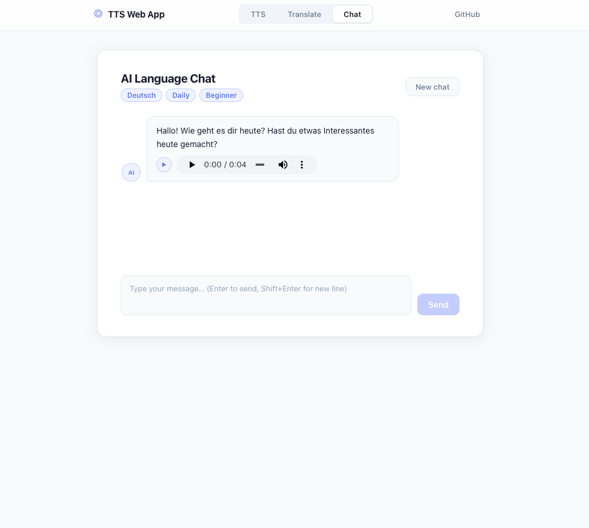

# LinguaAI — AI Language Companion

A web application for practicing German, Korean, and English using OpenAI APIs.  
Built with ASP.NET Core 10 / Blazor Server and deployed on Azure.

🔗 **Live demo:** https://tts-web-app-sabin.azurewebsites.net

---

## Why I built this

When I moved to Switzerland, I wanted to learn German — but I struggled with pronunciation and accurate translation. Google Translate was inaccurate, and using a general-purpose LLM as a translator was slow and inefficient as the chat history filled up.

I believe the most important thing when living in a foreign country is learning the local language, and that language can only truly be acquired by hearing it and speaking it yourself. So I built a tool that lets me do exactly that: hear correct pronunciation through TTS, get accurate AI-powered translations, and simulate real conversations with an AI tutor.

---

## Features

- **Text to Speech** — Convert any text to natural-sounding audio using OpenAI TTS. Supports multiple voices and playback speeds.
- **Translation** — Instantly translate between German, Korean, and English using GPT-4o mini.
- **AI Chat** — Practice conversations with an AI language tutor. Choose your language, topic, and level. Replies are read aloud automatically.

---

## Screenshots






---

## Tech Stack

| Layer | Technology |
|---|---|
| Framework | ASP.NET Core 10 / Blazor Server |
| Language | C# |
| AI APIs | OpenAI TTS, GPT-4o mini |
| Deployment | Azure App Service (Linux) |
| Auth | API key via environment variable |

---

## Getting Started (Local)

### Prerequisites
- [.NET 10 SDK](https://dotnet.microsoft.com/download)
- OpenAI API key from [platform.openai.com](https://platform.openai.com)

### Run locally

```bash
git clone https://github.com/your-username/TtsWebApp.git
cd TtsWebApp/TtsWebApp

dotnet user-secrets set "OpenAI:ApiKey" "sk-..."
dotnet run
```

Then open `https://localhost:5001` in your browser.

---

## Project Structure

```
TtsWebApp/
├── Components/
│   ├── Pages/
│   │   ├── Home.razor          # Landing page
│   │   ├── Tts.razor           # Text to Speech page
│   │   ├── Translate.razor     # Translation page
│   │   └── Chat.razor          # AI Chat page
│   └── Layout/
│       └── MainLayout.razor    # Navigation layout
└── Services/
    ├── OpenAiTtsService.cs     # TTS API integration
    ├── TranslationService.cs   # Translation API integration
    ├── ChatService.cs          # Chat API integration
    └── WhisperService.cs       # Whisper API integration
```

---

## Notes

- API key is never committed to source control
- Audio is streamed as base64 and played via JavaScript interop
- Chat history is stored in memory (session only)
